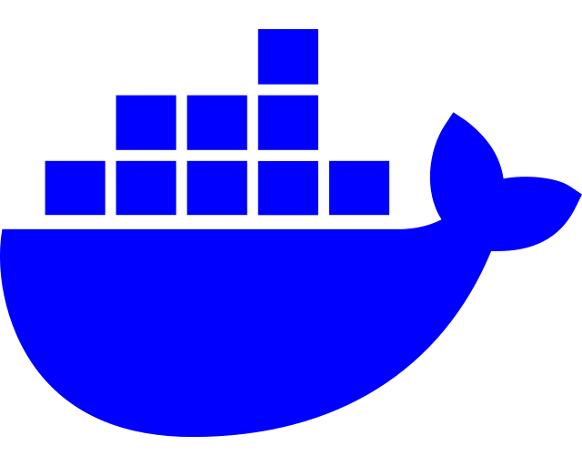

<!-- Improved compatibility of back to top link: See: https://github.com/othneildrew/Best-README-Template/pull/73 -->
<a id="readme-top"></a>
<!--
*** Thanks for checking out the Best-README-Template. If you have a suggestion
*** that would make this better, please fork the repo and create a pull request
*** or simply open an issue with the tag "enhancement".
*** Don't forget to give the project a star!
*** Thanks again! Now go create something AMAZING! :D
-->


<!-- PROJECT SHIELDS -->
<!--
*** I'm using markdown "reference style" links for readability.
*** Reference links are enclosed in brackets [ ] instead of parentheses ( ).
*** See the bottom of this document for the declaration of the reference variables
*** for contributors-url, forks-url, etc. This is an optional, concise syntax you may use.
*** https://www.markdownguide.org/basic-syntax/#reference-style-links
-->
[![Contributors][contributors-shield]][contributors-url]
[![Forks][forks-shield]][forks-url]
[![Stargazers][stars-shield]][stars-url]
[![Issues][issues-shield]][issues-url]
[![MIT License][license-shield]][license-url]
[![LinkedIn][linkedin-shield]][linkedin-url]


<!-- PROJECT LOGO -->
<br />
<div align="center">
  <a href="https://github.com/monatemedia/docker-engine-on-linux">
    
    
  </a>

<h3 align="center">Docker Engine On Linux</h3>

  <p align="center">
    A set of scripts to help you host your side projects on VPS using Linux and Docker.
    <br />
    <a href="https://github.com/monatemedia/docker-engine-on-linux"><strong>Explore the docs »</strong></a>
    <br />
    <br />
    <a href="https://github.com/monatemedia/docker-engine-on-linux">View Demo</a>
    ·
    <a href="https://github.com/monatemedia/docker-engine-on-linux/issues/new?labels=bug&template=bug-report---.md">Report Bug</a>
    ·
    <a href="https://github.com/monatemedia/docker-engine-on-linux/issues/new?labels=enhancement&template=feature-request---.md">Request Feature</a>
  </p>
</div>


<!-- TABLE OF CONTENTS -->
<details>
  <summary>Table of Contents</summary>
  <ol>
    <li>
      <a href="#about-the-project">About The Project</a>
      <ul>
        <li><a href="#built-with">Built With</a></li>
      </ul>
    </li>
    <li>
      <a href="#getting-started">Getting Started</a>
      <ul>
        <li><a href="#prerequisites">Prerequisites</a></li>
        <li><a href="#installation">Installation</a></li>
      </ul>
    </li>
    <li><a href="#usage">Usage</a></li>
    <li><a href="#roadmap">Roadmap</a></li>
    <li><a href="#contributing">Contributing</a></li>
    <li><a href="#license">License</a></li>
    <li><a href="#contact">Contact</a></li>
    <li><a href="#acknowledgments">Acknowledgments</a></li>
  </ol>
</details>


<!-- ABOUT THE PROJECT -->
## About The Project

[![Product Name Screen Shot][product-screenshot]](https://example.com)

The Problem: I have one VPS with a single IP Address. I want to be able to host my various side projects on my single VPS. I want to have these additional services.

* CI/CD Pipeline
* Databases
* Reverse Proxy
* HTTPS


Warning: Self hosting done right, can reduce the cost of hosting, but introduces additionaly complexity and can take longer to get to launch.

The Set Up: In my directory root, I have these apps:

* /svelte-counter
* /python-django-achievementhq

I want to be able to run all my apps at the same time on my VPS.


<p align="right">(<a href="#readme-top">back to top</a>)</p>

### Built With

[![Ububtu][Ubuntu.com]][Ubuntu-url]
[![Docker][Docker-hub]][Docker-hub-url]
[![Github Actions][Github-actions]][Github-actions-url]
[![Nginx][Nginx]][Nginx-url]
[![Svelte][Svelte.dev]][Svelte-url]
[![Laravel][Laravel.com]][Laravel-url]
[![Bootstrap][Bootstrap.com]][Bootstrap-url]
[![JQuery][JQuery.com]][JQuery-url]

<p align="right">(<a href="#readme-top">back to top</a>)</p>


<!-- SHARED PROXY -->
## Shared Proxy

You can use a single, centralized nginx-proxy container to manage your applications. This container will act as a reverse proxy and route traffic based on the subdomain to the correct application.

### Create Centralized Nginx Proxy

Create a new Docker Compose file (./shared-proxy/docker-compose.yml) for the shared nginx-proxy and letsencrypt-companion containers:

  ```sh
  services:
    nginx-proxy:
      container_name: nginx-proxy
      image: nginxproxy/nginx-proxy
      restart: unless-stopped
      ports:
        - "80:80"
        - "443:443"
      volumes:
        - /var/run/docker.sock:/tmp/docker.sock:ro
        - ./nginx/html:/usr/share/nginx/html
        - ./nginx/certs:/etc/nginx/certs
        - ./nginx/vhost:/etc/nginx/vhost.d
        - ./nginx/acme:/etc/acme.sh
      networks:
        - proxy-network

    letsencrypt-companion:
      container_name: letsencrypt-companion
      image: jrcs/letsencrypt-nginx-proxy-companion
      restart: unless-stopped
      volumes:
        - /var/run/docker.sock:/var/run/docker.sock:z
        - ./nginx/acme:/etc/acme.sh:rw
      networks:
        - proxy-network
      environment:
        DEFAULT_EMAIL: <yourEmail>

  networks:
    proxy-network:
      external: true
  ```


### Create Proxy Network

Create the proxy-network Docker network by running this bash command (only once):

  ```sh
  docker network create proxy-network
  ```

<p align="right">(<a href="#readme-top">back to top</a>)</p>

<!-- VITE SVELTE DOCKER COMPOSE -->
## VITE Svelte Docker Compose

This is an example of how you may set up your vite project locally. Here we are setting up this app: https://github.com/monatemedia/svelte-counter

### Create Docker Compose

From the root directory of your VPS create a folder called svelte-counter

```sh
mkdir svelte-counter
```

Enter the directory

```sh
cd svelte-counter
```

Make a file called `docker-compose.yml`

```sh
touch docker-compose.yml
```

Enter file with VIM or NANO and enter contents.

```sh
services:
  svelte-counter:
    container_name: svelte-counter
    image: ghcr.io/monatemedia/svelte-counter:latest
    environment:
      VIRTUAL_HOST: monatehub.monatemedia.com
      LETSENCRYPT_HOST: monatehub.monatemedia.com
    networks:
      - proxy-network

networks:
  proxy-network:
    external: true
```

Save and close the the file

<p align="right">(<a href="#readme-top">back to top</a>)</p>

<!-- PYTHON DJANGO DOCKER COMPOSE -->
## Python Django Docker Compose

This is an example of how you may set up your python django project locally. Here we are setting up this app: https://github.com/monatemedia/python-django-achievementhq

### Create Docker Compose

From the root directory of your VPS create a folder called python-django-achievementhq

```sh
mkdir python-django-achievementhq
```

Enter the directory

```sh
cd python-django-achievementhq
```

Make a file called `docker-compose.yml`

```sh
touch docker-compose.yml
```

Enter file with VIM or NANO and enter contents.

```sh
services:
  achievementhq_db:
    image: postgres:latest
    restart: unless-stopped
    environment:
      POSTGRES_DB: ${DB_NAME}
      POSTGRES_USER: ${DB_USER}
      POSTGRES_PASSWORD: ${DB_PASSWORD}
    volumes:
      - postgres_data:/var/lib/postgresql/data
    networks:
      - proxy-network

  achievementhq_web:
    image: ghcr.io/monatemedia/python-django-achievementhq:latest
    restart: unless-stopped
    env_file:
      - .env
    environment:
      VIRTUAL_HOST: achievementhq.monatemedia.com
      LETSENCRYPT_HOST: achievementhq.monatemedia.com
    networks:
      - proxy-network

volumes:
  postgres_data:

networks:
  proxy-network:
    external: true
```

Save and close the the file

<p align="right">(<a href="#readme-top">back to top</a>)</p>

<!-- USAGE EXAMPLES -->
## Usage

Use this space to show useful examples of how a project can be used. Additional screenshots, code examples and demos work well in this space. You may also link to more resources.

_For more examples, please refer to the [Documentation](https://example.com)_

<p align="right">(<a href="#readme-top">back to top</a>)</p>


<!-- ROADMAP -->
## Roadmap

- [ ] Feature 1
- [ ] Feature 2
- [ ] Feature 3
    - [ ] Nested Feature

See the [open issues](https://github.com/monatemedia/docker-engine-on-linux/issues) for a full list of proposed features (and known issues).

<p align="right">(<a href="#readme-top">back to top</a>)</p>


<!-- CONTRIBUTING -->
## Contributing

Contributions are what make the open source community such an amazing place to learn, inspire, and create. Any contributions you make are **greatly appreciated**.

If you have a suggestion that would make this better, please fork the repo and create a pull request. You can also simply open an issue with the tag "enhancement".
Don't forget to give the project a star! Thanks again!

1. Fork the Project
2. Create your Feature Branch (`git checkout -b feature/AmazingFeature`)
3. Commit your Changes (`git commit -m 'Add some AmazingFeature'`)
4. Push to the Branch (`git push origin feature/AmazingFeature`)
5. Open a Pull Request

<p align="right">(<a href="#readme-top">back to top</a>)</p>

### Top contributors:

<a href="https://github.com/monatemedia/docker-engine-on-linux/graphs/contributors">
  
</a>


<!-- LICENSE -->
## License

Distributed under the MIT License. See `LICENSE.txt` for more information.

<p align="right">(<a href="#readme-top">back to top</a>)</p>


<!-- CONTACT -->
## Contact

Monate Media - [@MonateMedia](https://twitter.com/MonateMedia) - edward@monatemedia.com 

Project Link: [https://github.com/monatemedia/docker-engine-on-linux](https://github.com/monatemedia/docker-engine-on-linux)

<p align="right">(<a href="#readme-top">back to top</a>)</p>


<!-- ACKNOWLEDGMENTS -->
## Acknowledgments

* [Othneil Drew Starter README Template](https://github.com/othneildrew/Best-README-Template/)
* [Ileriayo Adebiyi Markdown Badges](https://github.com/Ileriayo/markdown-badges)

<p align="right">(<a href="#readme-top">back to top</a>)</p>


<!-- MARKDOWN LINKS & IMAGES -->
<!-- https://www.markdownguide.org/basic-syntax/#reference-style-links -->
[contributors-shield]: https://img.shields.io/github/contributors/monatemedia/docker-engine-on-linux.svg?style=for-the-badge
[contributors-url]: https://github.com/monatemedia/docker-engine-on-linux/graphs/contributors
[forks-shield]: https://img.shields.io/github/forks/monatemedia/docker-engine-on-linux.svg?style=for-the-badge
[forks-url]: https://github.com/monatemedia/docker-engine-on-linux/network/members
[stars-shield]: https://img.shields.io/github/stars/monatemedia/docker-engine-on-linux.svg?style=for-the-badge
[stars-url]: https://github.com/monatemedia/docker-engine-on-linux/stargazers
[issues-shield]: https://img.shields.io/github/issues/monatemedia/docker-engine-on-linux.svg?style=for-the-badge
[issues-url]: https://github.com/monatemedia/docker-engine-on-linux/issues
[license-shield]: https://img.shields.io/github/license/monatemedia/docker-engine-on-linux.svg?style=for-the-badge
[license-url]: https://github.com/monatemedia/docker-engine-on-linux/blob/main/LICENSE.txt
[linkedin-shield]: https://img.shields.io/badge/-LinkedIn-black.svg?style=for-the-badge&logo=linkedin&colorB=555
[linkedin-url]: https://linkedin.com/company/monatemediaofficial
[product-screenshot]: images/screenshot.png
[Ubuntu.com]: https://img.shields.io/badge/Ubuntu-E95420?style=for-the-badge&logo=ubuntu&logoColor=white
[Ubuntu-url]: https://ubuntu.com/
[Docker-hub]: https://img.shields.io/badge/docker-%230db7ed.svg?style=for-the-badge&logo=docker&logoColor=white
[Docker-hub-url]: https://hub.docker.com/
[Github-actions]: https://img.shields.io/badge/github%20actions-%232671E5.svg?style=for-the-badge&logo=githubactions&logoColor=white
[Github-actions-url]: https://github.com/features/actions
[Nginx]: https://img.shields.io/badge/nginx-%23009639.svg?style=for-the-badge&logo=nginx&logoColor=white
[Nginx-url]: https://nginx.org/en/
[Svelte.dev]: https://img.shields.io/badge/Svelte-4A4A55?style=for-the-badge&logo=svelte&logoColor=FF3E00
[Svelte-url]: https://svelte.dev/
[Laravel.com]: https://img.shields.io/badge/Laravel-FF2D20?style=for-the-badge&logo=laravel&logoColor=white
[Laravel-url]: https://laravel.com
[Bootstrap.com]: https://img.shields.io/badge/Bootstrap-563D7C?style=for-the-badge&logo=bootstrap&logoColor=white
[Bootstrap-url]: https://getbootstrap.com
[JQuery.com]: https://img.shields.io/badge/jQuery-0769AD?style=for-the-badge&logo=jquery&logoColor=white
[JQuery-url]: https://jquery.com 